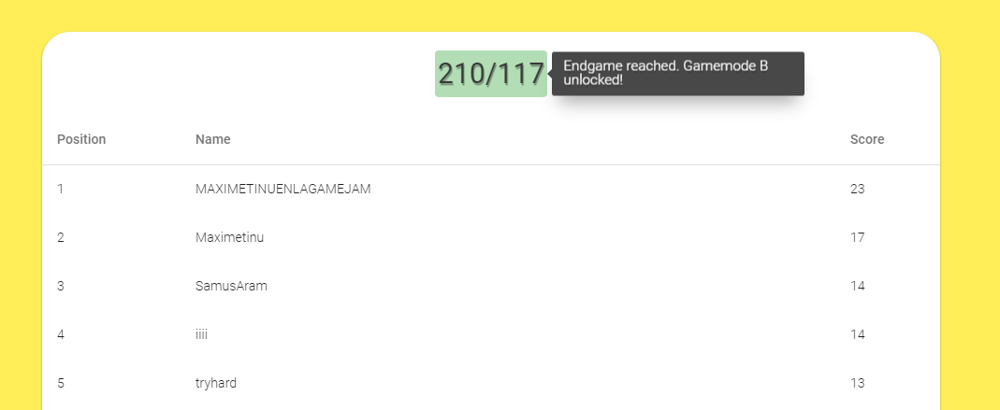

# No-Mans-Flappy-Unity
Entire Unity project, code and assets, for a WebGL game. Flappy bird clone.

WebGL build website: [nomansflappy.metinu.com](http://nomansflappy.metinu.com/). It takes a bit to load.

Web repo (and server-related scripts): [Github/Maximetinu/No-Mans-Flappy-Web](https://github.com/Maximetinu/No-Mans-Flappy-web)

## Instructions
Simply download the repo and open it as an Unity Project

## Screenshots

## Credits
Art and programming by myself.

Music by [Davis](https://www.instagram.com/davisnievas/).
